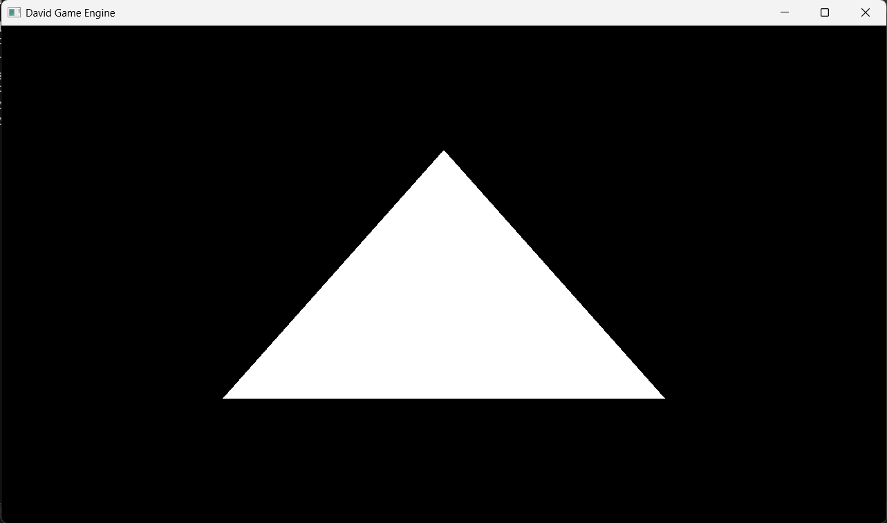

# Session Notes - DevLogs

This is not meant to have value for users of this code but to the author's learning journey. For information on how to use this Engine, go to the Wiki.

## Feb 21 2026
In the original, the instructor uses 
```C++
vertexLayout.elements.push_back({...VertexElement params.. })
 m_mesh = std::make_unique<eng::Mesh>(vertexLayout, rectangleVertices, rectangleIndices)

// I use:
vertexLayout.elements = new eng::VertexElement[vertexLayout.elementsCount]{};
m_mesh = new eng::Mesh(vertexLayout, &rectangleVertices[0], totalFComponentsCount, &rectangleIndices[0], RECT_INDICES_SIZE);

```
Value-initialization, all Vertex Elements are default-initialized `{0,0,0,0}`

A Deep copy is needed in the Mesh constructor. Since the `m_vertexLayout` is not in the initializer list, the compiler does:
```C++
m_vertexLayout = layout; 
```
1. Default-initialize the VertexLayout object `{nullptr, 0, 0}`
2. Uses the operator= to copy-assign to the `vertexLayout` gotten from the parameters.

Without a deep copy, `m_vertexLayout` and `m_vertexlayout` will point to the same memory address for the `elements` variable. This assignation calls alot of things implicitly in the std::vector class. 
## Feb 18 Feb
When creating a ShaderProgram in the GraphicsAPI class, memory is allocated on the heap. The original purpose of using smart pointers is to allow multiple owners of the object and to automatically track the number of references to it. This approach also reduces the risk of double deletion. In contrast, when using raw pointers and returning a new ShaderProgram, the caller is responsible for deallocating the resource.

## Feb 9 2026
- The egn.h library has been properly imported
- There's a WORKFLOW_GUIDELINES.md file to explain how to add files and update dependencies.

## Feb 7 2026

```C++
class App{/*some defintions*/};

// with smath pointers
std::unique_ptr<Application> m_app;

void SetApp(App *app)
{
    m_app.reset(app);
}

App* GetApp()
{
    return app.get();
}

```
*To use raw pointer the owership must be explicit, implementing proper RAII principles

**Assingment:** Render 5 unique objects (2D).
- [x] Use a different color/shape per object 
- [x] One object should animate over time
- [x] One object should response to keyboard input


## Feb 6 2026
- Uniforms are variables that can be set at runtime by the CPU but do not change throughout the draw call. One needs to get the location of the variables from the already compiled shader program.

## Feb 5 2026


- A game engine needs to display a window, which is its primary function. However, OpenGL itself is not a window library; that's where GLFW comes in. We use GLFW to manage the native behavior of the window and handle user inputs, while also setting it as the rendering context.

- OpenGL operates as a state machine and can only render one buffer of vertices at a time. This means that binding and unbinding resources is crucial to inform OpenGL what the CPU is attempting to render at any specific moment.

- It's also important to remember that OpenGL generates triangles in a counterclockwise orientation, with the z-axis pointing towards the camera.